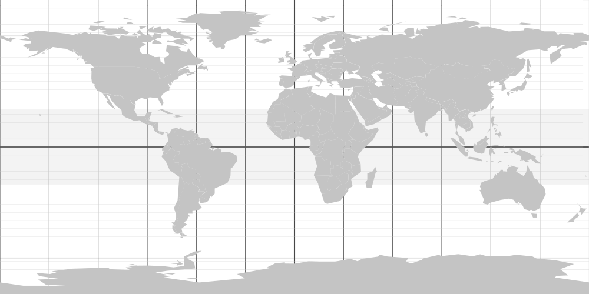
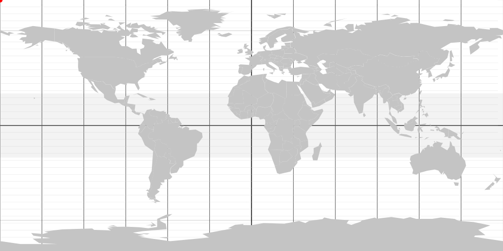
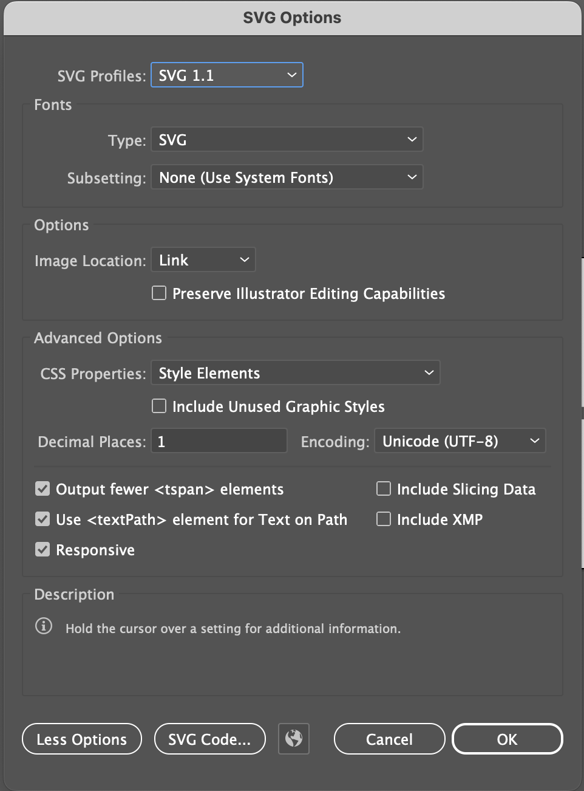
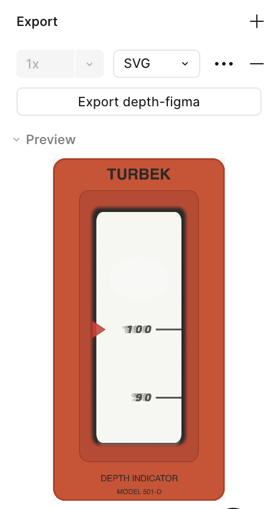
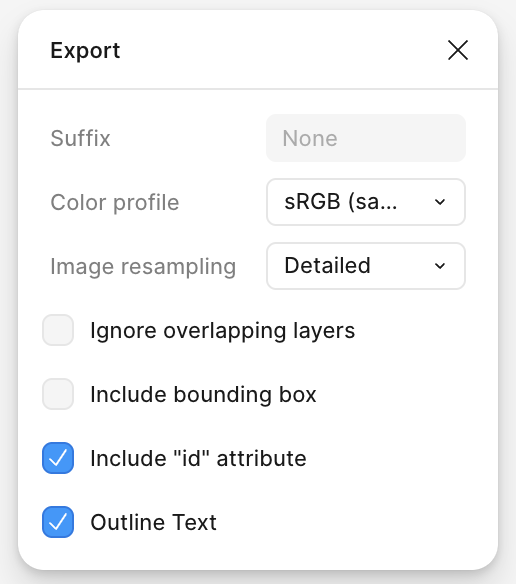
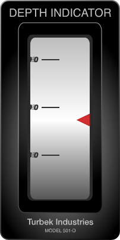

# Designing Interactive SVGs with AI

<div class="toc-wrapper" markdown="1">

## Contents

{: .no_toc}

- TOC
{:toc}
</div>

A short course for designers on making interactive SVGs with AI help.

<b class="hideFromJekyll-showInGithubPreview">For the best experience, go to the <a href="https://turbek.com/Designing-Interactive-SVGs-with-AI/"> article</a></b>

This article will be presented as a [CreativeMornings FieldTrip](https://creativemornings.com/fieldtrips) in January 2026.

<!-- [View Presentation](https://steveturbek.github.io/Designing-Interactive-SVGs-with-AI/presentation.svg) -->

In years past, designers used tools like Macromedia Director and Flash to make customer facing
, which blended the line between sketching and making, designing and programming. When Steve Jobs killed Flash in 2010 for being a ["closed system"](https://en.wikipedia.org/wiki/Thoughts_on_Flash), complex JavaScript-driven websites took over. The web effectively became the domain of programmers rather than visual designers.

**_Flash had many issues as a technology, but we should mourn the loss of a tool that let designers create directly, rather than write specs for others._**

This workshop is about reclaiming some of that power.

<figure>

<div id="oxygen-interactive">
   <div style="display: inline-block; text-align: center;">
     <object data="images/oxygen2.svg" type="image/svg+xml" width="300" class="interstitial_svg">
       
     </object>
     <div style="display: flex; gap: 10px; justify-content: center; margin-top: 10px;">
       <button class="oxygen2" type="button" id="oxygen2-decrease">-10</button>
       <button class="oxygen2" type="button" id="oxygen2-increase">+10</button>
     </div>
   </div>
   
   <script type="text/javascript">
      localStorage.setItem("oxygen2", "50");
   
      document.getElementById("oxygen2-decrease").addEventListener("click", function() {
         let currentValue = parseInt(localStorage.getItem("oxygen2")) || 50;
         localStorage.setItem("oxygen2", Math.max(0, Math.min(100, currentValue - 10)));
         window.dispatchEvent(new Event('storage'));
      });
   
      document.getElementById("oxygen2-increase").addEventListener("click", function() {
         let currentValue = parseInt(localStorage.getItem("oxygen2")) || 50;
         localStorage.setItem("oxygen2", Math.max(0, Math.min(100, currentValue + 10)));
         window.dispatchEvent(new Event('storage'));
      });
   </script>
</div>
<figcaption>
   An example data-driven interactive SVG, animated with AI in the workshop.  Click buttons to adjust it.
</figcaption>
</figure>

## TLDR

Design is all about precise communication, yet designers have struggled to communicate with computers. What if there was another way?

- Designers know design tools, but coding and interaction is often a challenge
- The SVG file format, known for icons, is unexpectedly, a powerful format similar to HTML. One can have style sheets and javascript in the file.
- Designers can use SVGs to include interactivity and delight in a project without breaking dev resources or code rules.
- SVG is a vector format, but is written in a language like HTML
- LLMs are great at manipulating language
- With proper set up, a designer can upload an image and collaborate the interaction into life.
- The SVG is now portable, contains its code.
- One can 'round trip' between design programs and AI, made easier with the tools included here

- **<a href="svg-ai-helper.html" target="new">SVG AI Helper</a>** used in this workshop to add interactivity to a SVG.

_Note: All code on this site works solely in the browser, no data is retained._ You can [download these open source web pages on Github](https://github.com/steveturbek/Designing-Interactive-SVGs-with-AI). They are designed to also work locally on your computer in Chrome.

<figure>
<object data="images/pitch.svg" type="image/svg+xml" width="300" class="interstitial_svg">
  
</object>
<figcaption>
   An example data-driven interactive SVG
</figcaption>
</figure>

## Background

I teach the "[Tangible Interfaces](https://steveturbek.github.io/Tangible-Interfaces/)" Senior Design Studio in the Industrial Design program at Pratt Institute. In my class, the students designed a 'working' dashboard of instruments as part of a personal submarine design.

These students had no coding experience, so I wrote a “Skill” to prep the AI to focus on the right things. It was pretty magical. This workshop extends this idea. It is not solely about dashboard design, but demonstrating a new way for designers to use AI, and rediscovering the power in the tools we designers always had.

<figure>
<object data="images/battery.svg" type="image/svg+xml" width="300" class="interstitial_svg">
  
</object>

<figcaption>
   An example data-driven interactive SVG
</figcaption>
</figure>

## What is SVG and can it be cured?

Human language is an incredibly flexible communication tool, but that flexibility comes at the cost of precision.

Markup Languages were created with the idea to wrap data in tags so BOTH computers and people could understand it.

```
<person>
   <name>Alice</name>
   <age>30</age>
</person>
```

SGML or Standard Generalized Markup Language was created in the 70's and used in newspapers and magazines. It inspired HTML Hyper Text Markup Language, XML, and _SVG (Scalable Vector Graphic)_.

SVGs are an **Graphic** file format, like JPEG, GIF, PNG. But SVGs store the information as math, not pixels. The drawing tools in Adobe Illustrator or Figma make **Vector** shapes like lines, rectangles, circles, and any complex curved shape. This means that the file size is tiny, but they are **Scalable** up to a billboard size without becoming blurry like a bitmap.

SVGs are used everywhere today, especially on the web.

<figure>
<object data="images/compass.svg" type="image/svg+xml" width="300" class="interstitial_svg">
  
</object>

<figcaption>
   An example data-driven interactive SVG
</figcaption>
</figure>

## Why do SVG matter today?

SVG is widely used on the web for icons and illustrations. BUT the SVG origin story gives it secret powers from those ancient times.

- Style visual elements and animate them with CSS (Cascading Style Sheets)
- JavaScript code can manipulate the file: Interactivity
- JavaScript code can load data: Data Visualization

**_These styles and code are carried inside the SVG file._**

SVGs matter because:

1. You, a designer, can use your tools like (Figma, Adobe Illustrator, or the open source Inkscape) and save as SVG.
1. You, a designer, can upload the SVG to your website, even locked down corporate Content Managed sites, where you can't get any dev resources to make your cool interactions.
1. SVGs can carry their styling and interaction code inside the file, which is encapsulated, so it can't break the website it is on.
1. They can use javascript to call out to the web and get data, like in a dashboard.
1. SVGs are written as a language and AIs are excellent at interpreting language.
1. As you, a designer, always name your design file layers (right??), you and the AI can have a specific conversation. "Rotate item carLogo 30 degrees" is very legible to an AI.

_One of the reasons AI is bad at understanding your prompts, is your human language prompts are simply not detailed enough. The big enhancement of modern AIs is they just guess what you might have meant. For most people this is fine, but designers care about the details._

<figure>
<object data="images/speed.svg" type="image/svg+xml" width="400" class="interstitial_svg">
  
</object>
<figcaption>
   An example data-driven interactive SVG
</figcaption>
</figure>

[_Thanks, Anthony Robinson for this cool font!_](https://www.1001fonts.com/14-segment-led-font.html)

## Animation in SVGs

The animation capabilities in a SVG are quite powerful. I'm not going to go deep into animation as there are so many more competent people (see references). But I want to highlight one because it is so conceptually cool. I'm sure you have seen the animation of someone "drawing" a shape. This "drawing" animation is only a couple of lines of code - the conceptual idea was to make this outline have a dashed line style, but the dashes are really huge. The animation slides that dash along the line, making it look like a drawing.

<figure>
<object data="images/z-animation.svg" type="image/svg+xml" width="400" class="interstitial_svg">
  
</object>

<figcaption>
   An example data-driven interactive SVG
</figcaption>
</figure>

## Interactivity in SVGs

Basically, everything you can do with a webpage: rollovers, buttons, etc can be done in a SVG. It uses the browser Javascript, almost the same as the web page.

## Example 1: Color Wheel : Basic Interactivity

Interactive SVGs can be a game changer for designers working with Devs.

A designer can add interactivity without developer help by uploading a SVG image, for example in Content Management Systems.

I made this handy color wheel for our Goldman Sachs Design System (which was public when I lead the team). It is still [available on Archive.org](https://web.archive.org/web/20220819072910/https://design.gs.com/home)

_Hover over any color segment to view its name, RGB values, and hex code. Click to lock the color information to copy values._

<figure>
<object data="images/GSDS-color-wheel-v2.svg" type="image/svg+xml" width="700" height="800" class="interstitial_svg">
  
</object>

<figcaption>
   An example data-driven interactive SVG
</figcaption>
</figure>

## Example 2: Currency Game : Data API & Game Logic

This SVG demonstrates a simple "game" that tests a user's ability to trade the US Dollar against the Euro. In the real world, this skill could make you millions, but this toy just demonstrates using interactive button clicks and real time financial market currency prices to keep a running score. The filesize is under 4k!

<figure>
<object data="images/currency-game.svg" type="image/svg+xml" width="400" class="interstitial_svg">
  
</object>

<figcaption>
   An example data-driven interactive SVG
</figcaption>
</figure>

## Example 3: Submarine Instruments : Webpage / SVG Communication

This project started out with a desire to empower my design students to connect physical controls to a computer game. We studied car dashboard design, and the interesting pros and cons of the screen-based driver experience.

Here is an [example chat session](https://chatgpt.com/share/690a222c-f46c-800d-9600-128b0e82be92){:target="\_blank"} to show the back and forth redesigning the dashboard speed instrument.

The technique we use in this interactive SVG is to communicate with the app webpage via a shared data source. I wanted this game to work locally on laptop with non-technical designers. Unfortunately for me, but fortunately for you, these browser security restrictions meant we had to be creative.

Browsers today have a neat feature called localStorage to storea data locally on your computer. It's sort of like a website cookie, but can hold much more information and is more secure. The info never leaves the browser. It also works across browser, windows, which was important because the game has a pop-up display window.

The basic strategy is to create an SVG, which has a built-in timer that looks for information and loads it regularly. This is essential, because otherwise extensive code needs to be written by the developers. When the code is encapsulated in the SVG, it is prevented from interfering with the rest of the webpage so you can be reasonably confident you can't break the rest of the website.

To make the game be able to communicate with the SVG, the game saves localStorage with names like "oxygen", or "battery". The SVG's were programmed to look for the information for each of the dashboard instrument.

The full submarine dashboard is outside the scope of this workshop, but [here's the link if you're interested](https://github.com/steveturbek/Tangible-Interfaces-Submarine-Design-Project/tree/main). I'm particularly proud of the drag and drop layout editor, which downloads a new instruments.css file the student uses to save the layout.

(Click buttons to adjust the Oxygen level.) These could just as easily be 2 SVGs communicating with each other.

## Pre-Workshop: What is the SVG AI Helper tool?

We are not going to recreate Flash in this workshop! If you want to get deep into data visualization, you should learn the tools like [D3js](https://d3js.org/what-is-d3)
The [gallery](https://observablehq.com/@d3/gallery) is awesome!

What we will do:

- Design an image of a data visualization
- Save as SVG
- Add some code using my helpers
- Work with AI to get it right

You will need:

- Design software. Adobe Illustrator is the best for this demo.
- Chrome browser and the internet
- AI access. They all can work, ChatGPT allows SVG upload without paying.
- 15-60 minutes, more if you use social media

### SVG AI Helper

**_The [SVG AI Helper](svg-ai-helper.html)_** is a webpage with JavaScript that helps prep your SVG to add interactivity using AI. It combines your files and my "AI SKill" instructions to guide the AI to understand the problem holistically.

1. You enter:
   1. Your SVG file
   1. Your text description of what you want to happen
1. You then paste the text into the chat window of the AI of your choice.
1. It may ask follow up questions if you were not explicit enough.
1. It should return some javascript code, which you can copy
1. You paste this code back into the SVG AI Helper window
1. You may get a working interactive SVG!
   1. If not: note what is wrong and you want to happen and try again. See troubleshooting section below
1. Iterate!

_Note: All code on this site works solely in the browser, no data is retained or is visible to anyone except yourself._ You can [download these open source web pages on Github](https://github.com/steveturbek/Designing-Interactive-SVGs-with-AI). They are designed to also work locally on your computer in Chrome. All the AI Skill instructions text is freely accessible in the web page code.

The <a href="/helpers/svg-code-transplant.html" target="new">SVG Code Transplant</a> tool is a webpage that copies SVG code from one SVG file to another. A typical use is if you make a working SVG, then edit in Illustrator (which deletes the code). This tool will copy it from the older working version to the new version. Assuming nothing important got changed, like layer names, it should work again.

## Workshop: Chart the International Space Station's location on a map

Let's start with a [Equirectangular World Map](https://commons.wikimedia.org/wiki/File:Longitude-latitude.svg) _Thanks Sven nestle2 at Wikipedia_

Equirectangular means they stretched a globe into a rectangle, which makes for easier math for this project. _I Just learned this also!_

Let's edit the image to crop and simplify the colors



Let's add a red circle in the middle, to represent the International Space Station. Do it in your design program OR better yet just open the file in TextEdit and simply pasting this right before the `</svg>`

```
<g id="ISS">
    <circle id="circle" class="st6" cx="0" cy="0" r="5"/>
</g>
```

(It makes a circle, in a group named ISS.). This is in a group, so when you open it in Illustrator it shows the group. Also, you could add more to the group layer later.



Let's use my [SVG AI Helper](svg-ai-helper.html). This workflow enables you to drop a SVG and describe what you want to happen. It combines it with special code instructions that can be pasted into a AI chat window. The AI is instructed to produce

Here's the prompt I used to animate this SVG

```
There's an API for the International Space Station at http://api.open-notify.org/iss-now.json
It returns: `{"timestamp": 1764169128, "iss_position":
   {"longitude": "12.3732", "latitude": "51.2351"}, "message": "success"}`
In my SVG there is an element with ID `ISS`
I want to position it on my equirectangular map based on lat/long from the API.
It doesn't need to be pixel-perfect.
I want it to update once a second
```

**It may not get it right at first, but iterate!**

Claude got it right on the first try, but ChatGPT took a second try. Here is an [example chatGPT session using workflow tool](https://chatgpt.com/share/692c3001-01e0-800d-96a4-fa3aa7d92fd5).

- It made a version [ISS Map - broken ](images/ISS-Map-4-simplified-styles-interactive-chatGPT-not-working.svg)
- I explained it wasn't working and it diagnosed the problem.
- It made a fixed version. [ISS Map - fixed](images/ISS-Map-5-simplified-styles-interactive-chatGPT-fixed.svg)

### Working ISS Tracker!

<figure>
<object data="images/ISS-Map-4-simplified-styles-interactive-claude.svg" type="image/svg+xml" width="800" class="interstitial_svg">
  
</object>

<figcaption>
   The working ISS tracker
</figcaption>
</figure>

## Wrap up

I hope this is demonstrated some fun and thought-provoking new tools for designers. To make the thing and not just design the thing. To use some old tools in a new way to empower designers to create richer experiences, even if they don't have a programmer handy.

For many years, there has been a debate about whether designers should "learn to code". Being a full programmer is a deeply skilled role, that neither a designer nor an AI will easily replace. But knowledge of the syntax of a programming language is only part of what it programmer does. It is routine in a design project that programmer will uncover the hidden cases while trying to write robust code. "where do we mail the check, if the person has no address, because they are homeless?" Far too often designers stick to the "happy path" when our job is to solve the problems our end-users have.

There is some irony in AI being created by programmers, who focus on programming problems, to develop AIs whose strongest skill is programming. But AI can be transformative for the designer, if harness properly. Any AI that is used to generate a design from scratch, necessarily means a generic design, as AI is fundamentally and averaging of the ideas of from the past.

Ultimately design is the communication of ideas, whether it is the idea about a product yet to be made, or the ideas in a product communicated to the end user. If we designers become better communicators, using our visual design tools with our new skills of working with AI coding assistants, both we and society will benefit.

## Tips and Notes

- To start off, these ideas are not the solution to every problem, they're more like a sketch of a recipe.
- The most important tip is to have as much patience as an AI. Ask it to explain.
- Be a good communicator: your prompt to the AI should be at least a paragraph long.
- Be a scientist, document each step. save versions.
- If you're trying something new start with something that works and make small changes in the direction you want.
- Don't be afraid to start over with a new prompt. You can always ask it to summarize the conversation to start a new prompt. This can be useful to understand misconceptions it may have.
- Try other AIs. They each have strengths and weaknesses.

### Technical tips

- Organize your files. Name your layers!!
- - **Check:** If a layer is named yourElementName, Open your SVG in a text editor and search for `id="yourElementName"`
- Some AIs have restrictions against uploading SVGs, at least on free plans. But pasting the SVG text is apparently fine.
- One can use custom fonts in SVG. [Google fonts](https://fonts.google.com/), [Adobe fonts](https://fonts.adobe.com/my_fonts#web_projects-section), or just many free font stores. You need to tell the SVG where to find the file. See the Speed gauge code for more.

### Exporting SVGs

**Adobe Illustrator Export**
Illustrator is the superior program for this specific workflow. It can import and edit SVGs directly.

Tips:

- It does have an annoying habit of renaming element IDs and the CSS styles, so be careful!
- It will delete the javascript code from the file, so use my [Code Transfer Tool](helpers/svg-code-transplant.html) to copy it back.

<style>
   .detail_images{
max-width:400px;
   }
   </style>




**Figma Export**

Figma exports SVGs very well, but it is not a native SVG editor. You can import and export the files, but it is harder. There are plugins that help.

- Make sure to enable 'include "ID" attribute' in the details pop up




### Troubleshooting

You WILL break the SVG at times. Don't panic! Usually it is some extra character or a missing ". Upload to an AI and give it the error message. They are VERY good at this.

- Test by opening SVG directly in browser. File > Open
- Sometimes you will see pinkish area with an error text. Usually it will say where the error is. Share the file and error with the AI.
- Check: Open browser console (View > Developer > JavaScript Console) Look for: Red error messages
- Element IDs must match layer names from Figma/Illustrator
- Common error: “Cannot read property ‘setAttribute’ of null” means element ID not found

**Problem: "The SVG works when opened individually, but not on a page"**

- The `` HTML tag blocks javascript, use `<object data="file.svg">`.

**Problem: "I re-exported from Figma and my code disappeared"**

Figma exports a fresh SVG without your previous code

Use my [Code Transplant](helpers/svg-code-transplant.html) Tool with:

1. Your OLD SVG (has working code)
2. Your NEW SVG (updated design, no code)

**Problem: "Element IDs changed after re-exporting"**

Figma/Illustrator sometimes generates new random IDs.

1. In your design tool, explicitly name your layers BEFORE exporting
2. Use simple names: "needle", "indicator", "bar"
3. If IDs changed, update the code:
   - **Old:** `document.getElementById('path_12345')`
   - **New:** `document.getElementById('needle')`

### How to Read Error Messages

**"Cannot read property 'setAttribute' of null"**

- **Means:** Element with that ID doesn't exist
- **Fix:** Check element ID spelling in code and SVG

**"Uncaught SyntaxError: Unexpected token"**

- **Means:** Missing quote, bracket, or parenthesis
- **Fix:** Check that all quotes and brackets are paired: `( )` `{ }` `' '` `` ` ` ``

**"value is not defined"**

- **Means:** Variable name used before being created
- **Fix:** Make sure `const value = ...` line comes before you use `value`

### Code Quick Reference

#### Common Element Selection

```javascript
document.getElementById("elementName");
```

#### Common Transformations

```javascript
// Rotation
element.setAttribute("transform", `rotate(${angle} centerX centerY)`);

// Translation (move position)
element.setAttribute("transform", `translate(${x} ${y})`);

// Scale (change size)
element.setAttribute("transform", `scale(${size})`);
```

#### Common Attribute Changes

```javascript
// Fill color
element.setAttribute("fill", "red");
element.setAttribute("fill", `rgb(${r}, ${g}, ${b})`);

// Opacity
element.setAttribute("opacity", "0.5"); // 0=invisible, 1=solid

// Stroke color
element.setAttribute("stroke", "blue");
```

#### Console Logging (for debugging)

```javascript
console.log("My value is:", value);
console.log("Calculated angle:", angle);
```

Then check Console in browser to see the values.

### Security Note

Like all code, javascript can be used to harm people. Some websites have strict rules against SVG or disable javascript in SVG to prevent people from stealing other people's data. Don't be evil.


<object data="images/depth.svg" type="image/svg+xml" width="200" class="interstitial_svg">
  
</object>

## References

- [The Secret Origin of SVG](https://www.w3.org/Graphics/SVG/WG/wiki/Secret_Origin_of_SVG)
- [History of Scalable Vector Graphics (SVG) File Format Family](https://www.loc.gov/preservation/digital/formats/fdd/fdd000515.shtml)
- [W3C SVG 1.1 Specification - Scripting](https://www.w3.org/TR/SVG11/script.html)

### Online Guides for Learning CSS Animations for SVGs

#### For Beginners

- [CSS-Tricks](https://css-tricks.com/animating-svg-css/)
- [LogRocket](https://blog.logrocket.com/how-to-animate-svg-css-tutorial-examples/)
- [Toptal](https://www.toptal.com/css/svg-animation-css-tutorial)

#### Comprehensive Learning

- [Interactive SVG Animations](https://www.svg-animations.how/)
- [Smashing Magazine](https://www.smashingmagazine.com/2014/11/styling-and-animating-svgs-with-css/)

#### Reference Documentation

- [W3Schools](https://www.w3schools.com/graphics/svg_animation.asp)
- [MDN](https://developer.mozilla.org/en-US/docs/Web/SVG/Reference/Element/animate)

### Software Tools for SVG Animation

#### No-Code Animation Tools

- [SVGator](https://www.svgator.com/)
- [SVG AI](https://www.svgai.org/animate)

#### Design Software with SVG Support

- Adobe Illustrator
- Inkscape
- Figma
- Affinity Designer (I haven't used)

### APIs to consider

(choosing ones that change frequently)

- [Where is the International Space Station](http://api.open-notify.org/iss-now.json)
- [Weather on Mt Everest](https://api.open-meteo.com/v1/forecast?latitude=27.9882&longitude=86.9254&current_weather=true)
- [USD to GBP Exchange Rate](https://api.coinbase.com/v2/prices/GBP-USD/spot)
- [USD to EUR Exchange Rate](https://api.coinbase.com/v2/prices/EUR-USD/spot)

<!-- https://commons.wikimedia.org/wiki/File:International_Space_Station_top_view.svg -->

### SVG History

[Wikipedia on SVG](https://en.wikipedia.org/wiki/SVG)

**Early development (late 1990s)**

- Multiple competing proposals submitted to W3C for vector graphics on the web
- Microsoft had VML (Vector Markup Language)
- Adobe, Sun, others had PGML (Precision Graphics Markup Language)
- Macromedia had proposals too
- W3C merged ideas into SVG specification

**SVG 1.0 (2001)**

- First official W3C recommendation
- XML-based vector graphics format
- Designed to work with other web standards (CSS, JavaScript, DOM)

**The plugin era (2001-2010)**

- Browsers had poor native support
- Adobe SVG Viewer plugin was common
- Competed with Flash, which dominated vector/animation on web
- SVG existed but wasn't widely used for actual websites

**Mobile/Flash's decline (2007-2010)**

- iPhone didn't support Flash
- Steve Jobs's famous letter against Flash (2010)
- Suddenly need for open, standard vector format
- Browsers started implementing native SVG support seriously
- Mobile phones supported it before most desktop browsers.

**Modern era (2010s+)**

- All major browsers support SVG natively
- Became standard for responsive icons, logos, data visualizations
- Tools like D3.js made SVG the de facto standard for web-based charts
- Design tools (Sketch, Figma, Illustrator) all export SVG

**_The irony: took 10+ years to become useful because browser support lagged, then Flash's death suddenly made it essential._**

Side note: its fascinating to see the present from the perspective of the past. Things that are fact today, was just one of many options being debated. People thought that slow phone speeds meant we should have a completely web for phone written in "[WML](https://en.wikipedia.org/wiki/Wireless_Markup_Language)".
