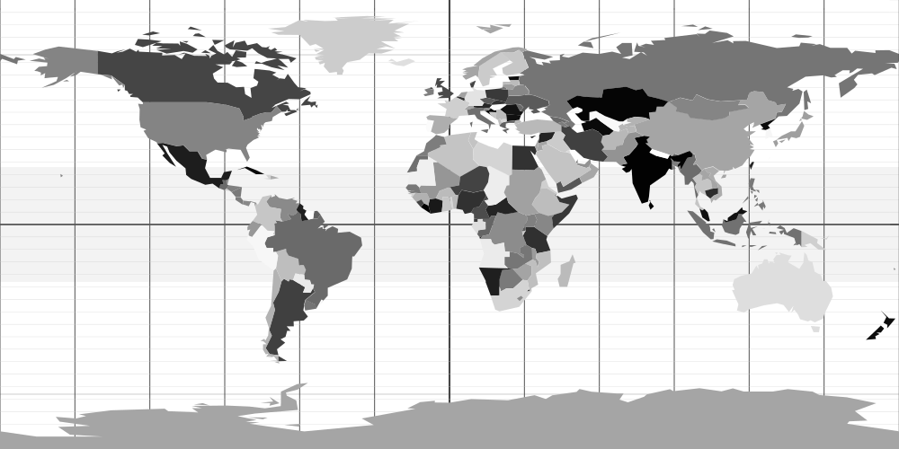
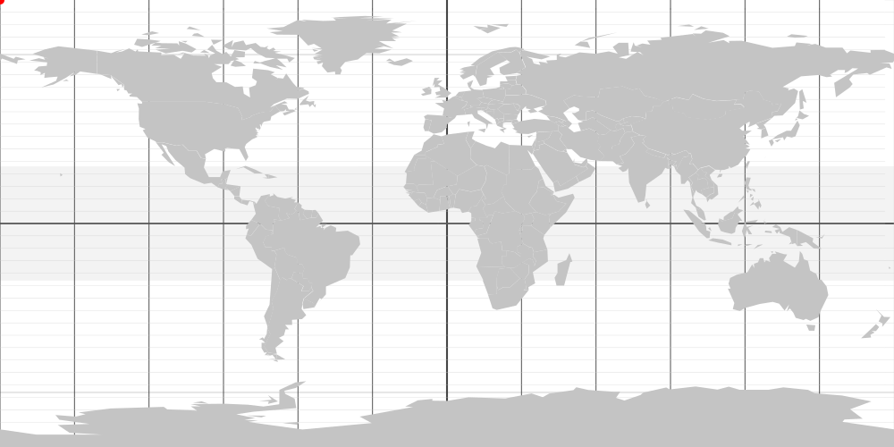

# Designing Interactive SVGs with AI

A short course for designers on making interactive SVGs with AI help. It will be presented as a [CreativeMornings FieldTrip](https://creativemornings.com/fieldtrips) in January 2026. [View Presentation](https://steveturbek.github.io/Designing-Interactive-SVGs-with-AI/presentation.svg)

<b class=".hideFromJekyll-showInGithubPreview">For the best experience, go to the <a href="https://turbek.com/Designing-Interactive-SVGs-with-AI/">actual article web page</a></b>

<div class="toc-wrapper" markdown="1">

## Contents

{: .no_toc}

- TOC
{:toc}
</div>

## TLDR

- Designers know design tools, but coding and interaction is often a challenge
- The SVG file format, known for icons, is unexpectedly, a powerful format similar to HTML. One can have style sheets and javascript in the file.
- Designers can use SVGs to include interactivity and delight in a project without breaking dev resources or code rules.
- SVG is a vector format, but is written in a language like HTML
- LLMs are great at manipulating language
- With proper set up, a designer can upload an image and collaborate the interaction into life.
- The SVG is now portable, contains its code.
- One can 'round trip' between design programs and AI, made easier with the tools included here


## Background

I teach the "[Tangible Interfaces](https://steveturbek.github.io/Tangible-Interfaces/)" Senior Design Studio in the Industrial Design program at Pratt Institute.

In my workshop, the students designed a dashboard of instruments as part of a personal submarine design.
I wrote a “Skill” to prep the AI to focus on the right thing, and use the right context. They had no coding experience, It was pretty magical….

The workshop is not specifically about dashboard elements. It is more conceptual reframing about design tools and AI, and rediscovering tools we designers always had.

## What is SVG and can it be cured?

As we all know, markup languages were given to humans by ancient aliens. We have be able to reconstruct it as "SGML" or Standard Generalized Markup Language. No one speaks SGML today, but archeological evidence suggests SGML was used in "newspapers" and "magazines", which appeared to made by primitive people from trees or bark.

The basic idea is to wrap data in tags so BOTH computers and people could understand it.

`<person><name>Alice</name><age>30</age></person>`

SGML had many descendants, including Hyper Text Markup Language and XML. XML birthed hundreds of niche markup formats. The main one that survives today is _SVG (Scalable Vector Graphics)_.

SVGs are an **graphic** format, like JPEG, GIF, PNG. But they store the information not as pixels, but math. It has lines, rectangles, circles, and any complex curved shape. (If you think of the drawing tools in Adobe Illustrator or Figma, these are **vector** shapes.). This means that the file size is tiny, but they are **scalable** up to a billboard size without becoming blurry. Fonts are a kind of vector file as well. They are used everywhere, especially on the web.

## What was Flash and why did it matter?

Flash was a program that made animations that ran in the web browsers of the 90's and early 2000's. By working quickly and consistently across browsers (a huge problem of the time), it enabled designers to deliver a beautiful experience. It was the only way to deliver video and music streams, and became wildly popular, to the point that entire websites would simply be a flash file.

Flash had a visual style that defined 1990s websites, for better and worse. Like any tool that empowers many people, it became associated with cheaply written web games and cartoons. When Steve Jobs killed Flash for being a ["closed system"](https://en.wikipedia.org/wiki/Thoughts_on_Flash) LOL, (not for competing with the App store).

For all its flaws, Flash was a designer's program, and there has not been a replacement. Flash empowered designers to lay out scenes and animations with drawing tools and interactivity, without requiring programming knowledge. When Flash was killed, complex JavaScript-driven websites took over, which effectively meant the web became the domain of programmers rather than visual designers. The web changed from wacky personal experiences to a more professional, some would say banal, standard.

I was never a Flash designer/developer. Like many 90's kid designers, I learned programming in a program called Macromedia Director, most famous for making interactive CD-ROMs, which, I swear, were a big deal. I used its "Shockwave" web framework to make interactive games and experiences. Sadly, none are visible on today's technology.

**_We should mourn the loss of a tool that empowered designers to think in their own visual language and create the item rather than write specification documents to instruct others what to do._**

## "OK, Old timer, why does SVG matter to-day"?

SVG is widely used on the web for icons and illustrations. BUT its origin story gives it secret powers from those ancient times.

- CSS can style SVG elements: Animations
- JavaScript can manipulate the file: Interactivity
- JavaScript can load data: Data Visualization
  **_Inside the SVG file_**

SVGs matter because:

1. You, a designer, can use your tools like (Figma, Adobe Illustrator, or the open source Inkscape) and save as SVG.
1. You, a designer, can upload the SVG to your website, even locked down corporate Content Managed sites, where you can't get any dev resources to make your cool interactions.
1. SVGs can carry their styling and interaction code inside the file, which is encapsulated, so it can't break the website it is on.
1. They can use javascript to call out to the web and get data, like in a dashboard.
1. SVGs are written as a language and AIs are excellent at interpreting language.
1. As you, a designer, always name your design file layers (right??), you and the AI can have a specific conversation. "Rotate item carLogo 30 degrees" is very legible to an AI.

_One of the reasons AI is bad at understanding your prompts, is your human language prompts are simply not detailed enough. The big enhancement of modern AIs is they just guess what you might have meant. For most people this is fine, but designers care about the details.
_

### Animation

I'm not going to go deep into animation as there are so many more competent people (see references). But I want to highlight one because it is so conceptually cool. I'm sure you have seen the animation of someone drawing an item, like this.  


What if I told you that this animation was only a couple of lines of code - the conceptual idea was to make this shape have a dashed line, only with really huge dashes, and slide that dash along the line. The designer never drew anything.

### Interactivity

Basically, everything you can do with a webpage: rollovers, buttons, etc can be done in a SVG. It uses the browser Javascript, almost the same as the web page.

### Interactive Color Wheel

Interactive SVGs can be a game changer for designers working with Devs.

A designer can ‘sneak’ interactivity into old codebases where they couldn’t touch the code, by uploading an image to a Content Management System.

I made this handy color wheel for our Goldman Sachs Design System (which was public when I lead the team). It is still [available on Archive.org](https://web.archive.org/web/20220819072910/https://design.gs.com/home)

_Hover over any color segment to view its name, RGB values, and hex code. Click to lock the color information to copy values._

<object data="images/GSDS-color-wheel-v2.svg" type="image/svg+xml" width="700" height="800">
  
</object>

## The workshop: Coding an interactive, data driven, illustration

We are not going to recreate Flash in this workshop. If you want to get deep into data visualization, you should learn the real tools like [D3js](https://d3js.org/what-is-d3)
The [gallery](https://observablehq.com/@d3/gallery) is awesome!

What we will do:

- Design an image of a data visualization
- Save as SVG
- Add some code using my helpers
- Work with AI to get it right

You need:

- A design software Adobe Illustrator is the best for this demo.
- Chrome browser and the internet
- AI access. They all can work, ChatGPT allows SVG upload without paying.
- 60 minutes, more if you use social media

### Workshop 1: Chart the International Space Station's location on a map

1. Let's start with a [Equirectangular World Map](https://commons.wikimedia.org/wiki/File:Longitude-latitude.svg) _Thanks Sven nestle2 at Wikipedia_

Equirectangular means they stretched a globe into a rectangle, which makes for easier math for this project.



1. Let's add a red circle in the middle, to represent the ISS. Do it in your design program OR just open the file in TextEdit and simply pasting this right before the `</svg>`

```
<g id="ISS">
    <circle id="circle" class="st6" cx="0" cy="0" r="5"/>
</g>
```

(It makes a circle, in a group named ISS.). This is in a group, so when you open it in Illustrator it shows the group. Also, you could add more to the group layer later.


1. Let's open the file and reduce the number of colors.


1. Let's use my [SVG AI Helper](svg-ai-helper.html). This workflow enables you to drop a SVG and describe what you want to happen. It combines it with special code instructions that can be pasted into a AI chat window. The AI is instructed to produce

Here's the description for this ISS SVG

```
There's an API for the International Space Station at http://api.open-notify.org/iss-now.json
It returns: `{"timestamp": 1764169128, "iss_position": {"longitude": "12.3732", "latitude": "51.2351"}, "message": "success"}`
In my SVG is an element with ID `ISS`
I want to position it on my equirectangular map based on lat/long from the API.
It doesn't need to be pixel-perfect.
I want it to update once a second
```

**It may not get it right at first!**
Here is an [example chat using workflow tool](https://chatgpt.com/share/692c3001-01e0-800d-96a4-fa3aa7d92fd5).

- It made a version [ISS Map - broken ](images/ISS-Map-4-simplfied-styles-interactive-chatGPT-not-working.svg)
- I explained it wasn't working and it diagnosed the problem.
- It made a fixed version. [ISS Map - fixed](images/ISS-Map-5-simplfied-styles-interactive-chatGPT-fixed.svg)

1. Working ISS Tracker!
   

### Workshop 4: Submarine Instruments and working with apps

Here is an [example chat session](https://chatgpt.com/share/690a222c-f46c-800d-9600-128b0e82be92) to show the back and forth redesigning a dashboard instrument.

## Tips and Notes

### Security Note

Like all code, javascript can be used to harm people. Some websites have strict rules against SVG or disable javascript in SVG to prevent people from stealing other people's data. Don't be evil.


### Fonts

One can use Web Fonts. Google fonts and [Adobe fonts](https://fonts.adobe.com/my_fonts#web_projects-section).

### SVG Animation Troubleshooting Guide

#### How Your SVG Animation Works

Your SVG file contains:

1. **Visual elements** - the shapes and designs you made in Figma/Illustrator
2. **JavaScript code** - instructions that make things move or change
3. **A timer** - runs your animation code repeatedly (1-10 times per second)

The code is wrapped in special tags that tell the browser "this is JavaScript inside an SVG."

#### The STUDENT EDIT ZONE

Your SVG has boundary markers that look like this:

```javascript
// ========================================
// STUDENT EDIT ZONE
// ========================================

// Your animation code goes here

// ========================================
// END STUDENT EDIT ZONE
// ========================================
```

**Rule:** Only edit code between these markers. Everything else is infrastructure that makes the animation work.

### Common Problems & Solutions

#### Problem: "My animation isn't moving"

**Possible causes:**

1. **Element ID doesn't exist**

   - **Check:** Open your SVG in a text editor and search for `id="yourElementName"`
   - **Fix:** In Figma/Illustrator, you must name your layers before exporting
   - **Example:** A layer named "needle" in Figma becomes `id="needle"` in the SVG

2. **File not opened correctly**

   - **Wrong:** Dragging SVG into an HTML page as ``
   - **Right:** Double-click the SVG file to open it directly in your browser
   - **Right:** Use `<object data="file.svg">` tag in HTML

3. **JavaScript errors**

   - **Check:** Open browser console (View > Developer > JavaScript Console)
   - **Look for:** Red error messages
   - **Common error:** "Cannot read property 'setAttribute' of null" means element ID not found

4. **localStorage not set**
   - If your animation reads from `localStorage.getItem('speed')`, something needs to set that value
   - **For testing:** See "Testing Without a Dashboard" section below

#### Problem: "Animation moves the wrong direction"

**Possible causes:**

1. **Formula needs to be reversed**
   - **Change:** `angle = -45 + value * 0.9`
   - **To:** `angle = -45 - value * 0.9` (flip the + to -)
2. **Range is backwards**
   - **Change:** `y = 150 - value * 1.0`
   - **To:** `y = 50 + value * 1.0`

#### Problem: "Animation moves too fast/slow"

**Solution:** Change the update frequency

Find this line (outside the STUDENT EDIT ZONE):

```javascript
const update_SVG_times_per_second = 1;
```

- For smoother animation: increase to `5` or `10`
- For slower updates: decrease to `0.5` or `1`

#### Problem: "Element rotates around the wrong point"

**What's happening:** Rotation needs a center point (origin)

**In the code you'll see:**

```javascript
document.getElementById("needle").setAttribute("transform", `rotate(${angle} 256 256)`);
```

The numbers `256 256` are the X and Y coordinates of the rotation point.

**To find the right center point:**

1. **Option 1 - Use SVG center:**

   - If your SVG viewBox is `0 0 512 512`, center is `256 256`
   - If your SVG viewBox is `0 0 400 400`, center is `200 200`

2. **Option 2 - Use element's position:**

   - Open SVG in text editor
   - Find your element (search for `id="needle"`)
   - Look for `cx` and `cy` attributes (circle center) or calculate shape center
   - Use those coordinates

3. **Option 3 - Trial and error:**
   - Try different numbers and refresh browser
   - Adjust until rotation looks right

#### Problem: "I re-exported from Figma and my code disappeared"

**What happened:** Figma exports a fresh SVG without your previous code

**Solution: Merge your code back in**

You need TWO files:

1. Your OLD SVG (has working code)
2. Your NEW SVG (updated design, no code)

Upload both files to Claude and ask:

> "I re-exported my design from Figma. Please merge my animation code from the old file into the new design."

#### Problem: "Element IDs changed after re-exporting"

**What happened:** Figma/Illustrator sometimes generates new random IDs

**Solution:**

1. In your design tool, explicitly name your layers BEFORE exporting
2. Use simple names: "needle", "indicator", "bar"
3. If IDs changed, update the code:
   - **Old:** `document.getElementById('path_12345')`
   - **New:** `document.getElementById('needle')`

#### Problem: "Console shows 'Update_SVG' but nothing moves"

**Possible causes:**

1. **Element not found** (see "Element ID doesn't exist" above)

2. **Formula produces NaN (Not a Number)**

   - **Check console for:** `NaN` in the logged values
   - **Common cause:** `localStorage.getItem()` returns `null` or invalid string
   - **Fix:** Add a default value:
     ```javascript
     const value = parseFloat(localStorage.getItem("speed")) || 0;
     // The || 0 provides a default if localStorage is empty
     ```

3. **Rotation/translation not visible**
   - Try extreme test values to see if anything happens
   - Example: Force `angle = 180` to see maximum rotation

### Testing Without a Dashboard

If your animation reads from localStorage but you don't have a dashboard yet:

**Option 1: Browser Console**

1. Open your SVG in browser
2. Open Console (View > Developer > JavaScript Console)
3. Type and press Enter:
   ```javascript
   localStorage.setItem("speed", "75");
   ```
4. Watch your animation update

**Option 2: Add Test Code Temporarily**

In the STUDENT EDIT ZONE, replace the localStorage line:

```javascript
// TEMPORARY TEST CODE - Remove when connecting to dashboard
const value = 75; // Force value to 75 for testing

// Later, replace with:
// const value = parseFloat(localStorage.getItem('speed')) || 0;
```

### Understanding the Code

#### Getting Data

```javascript
const value = parseFloat(localStorage.getItem("speed")) || 0;
```

Breaking this down:

- `localStorage.getItem('speed')` - gets data stored under key "speed"
- `parseFloat(...)` - converts text to a number
- `|| 0` - if nothing found, use 0 as default

#### Mapping Values (Formulas)

**Example: Map 0-100 to angle -45° to +45°**

```javascript
const angle = -45 + value * 0.9;
```

How this works:

- When `value = 0`: angle = -45 + 0 = -45°
- When `value = 50`: angle = -45 + 45 = 0°
- When `value = 100`: angle = -45 + 90 = +45°

The magic number `0.9` comes from: 90° range ÷ 100 values = 0.9° per value

#### Applying Transformations

```javascript
element.setAttribute("transform", `rotate(${angle} 256 256)`);
```

Breaking this down:

- `element` - the thing you want to move
- `setAttribute` - change one of its properties
- `transform` - the property we're changing (how it's positioned/rotated)
- `rotate(angle x y)` - rotate by angle degrees around point (x, y)
- The backticks `` ` `` and `${}` let us insert the angle value

### How to Read Error Messages

**"Cannot read property 'setAttribute' of null"**

- **Means:** Element with that ID doesn't exist
- **Fix:** Check element ID spelling in code and SVG

**"Uncaught SyntaxError: Unexpected token"**

- **Means:** Missing quote, bracket, or parenthesis
- **Fix:** Check that all quotes and brackets are paired: `( )` `{ }` `' '` `` ` ` ``

**"value is not defined"**

- **Means:** Variable name used before being created
- **Fix:** Make sure `const value = ...` line comes before you use `value`

### Getting Help

When asking for help, provide:

1. **What you're trying to do**
   - "I want the needle to rotate based on speed"
2. **What's actually happening**
   - "The needle doesn't move at all"
   - "The needle rotates backwards"
3. **Your SVG file** with the code
4. **Console errors** if any (screenshot the red text)

5. **Element names** you're trying to animate
   - "My layer in Figma is called 'speedNeedle'"

### Quick Reference

#### Common Element Selection

```javascript
document.getElementById("elementName");
```

#### Common Transformations

```javascript
// Rotation
element.setAttribute("transform", `rotate(${angle} centerX centerY)`);

// Translation (move position)
element.setAttribute("transform", `translate(${x} ${y})`);

// Scale (change size)
element.setAttribute("transform", `scale(${size})`);
```

#### Common Attribute Changes

```javascript
// Fill color
element.setAttribute("fill", "red");
element.setAttribute("fill", `rgb(${r}, ${g}, ${b})`);

// Opacity
element.setAttribute("opacity", "0.5"); // 0=invisible, 1=solid

// Stroke color
element.setAttribute("stroke", "blue");
```

#### Update Speed

```javascript
// Outside STUDENT EDIT ZONE
const update_SVG_times_per_second = 10; // Change this number
```

#### Console Logging (for debugging)

```javascript
// Inside STUDENT EDIT ZONE
console.log("My value is:", value);
console.log("Calculated angle:", angle);
```

Then check Console in browser to see the values.

### Remember

- Only edit code in the STUDENT EDIT ZONE
- Element IDs must match layer names from Figma/Illustrator
- Test by opening SVG directly in browser
- Check Console for errors and debug messages
- Default values (using `|| 0`) prevent errors when data missing
- Ask for help with both your SVG file and description of the problem

## References

- [The Secret Origin of SVG](https://www.w3.org/Graphics/SVG/WG/wiki/Secret_Origin_of_SVG)
- [History of Scalable Vector Graphics (SVG) File Format Family](https://www.loc.gov/preservation/digital/formats/fdd/fdd000515.shtml)
- [W3C SVG 1.1 Specification - Scripting](https://www.w3.org/TR/SVG11/script.html)

### Online Guides for Learning CSS Animations for SVGs

#### For Beginners

- [CSS-Tricks](https://css-tricks.com/animating-svg-css/)
- [LogRocket](https://blog.logrocket.com/how-to-animate-svg-css-tutorial-examples/)
- [Toptal](https://www.toptal.com/css/svg-animation-css-tutorial)

#### Comprehensive Learning

- [Interactive SVG Animations](https://www.svg-animations.how/)
- [Smashing Magazine](https://www.smashingmagazine.com/2014/11/styling-and-animating-svgs-with-css/)

#### Reference Documentation

- [W3Schools](https://www.w3schools.com/graphics/svg_animation.asp)
- [MDN](https://developer.mozilla.org/en-US/docs/Web/SVG/Reference/Element/animate)

### Software Tools for SVG Animation

#### No-Code Animation Tools

- [SVGator](https://www.svgator.com/)
- [SVG AI](https://www.svgai.org/animate)

#### Design Software with SVG Support

- Adobe Illustrator
- Inkscape
- Figma
- Affinity Designer (I haven't used)

### APIs to consider

(choosing ones that change frequently)

- [Where is the International Space Station](http://api.open-notify.org/iss-now.json)
- [Weather on Mt Everest](https://api.open-meteo.com/v1/forecast?latitude=27.9882&longitude=86.9254&current_weather=true)
- [USD to GBP Exchange Rate](https://api.coinbase.com/v2/prices/GBP-USD/spot)
- [USD to EUR Exchange Rate](https://api.coinbase.com/v2/prices/EUR-USD/spot)

<!-- https://commons.wikimedia.org/wiki/File:International_Space_Station_top_view.svg -->

### SVG History

[Wikipedia on SVG](https://en.wikipedia.org/wiki/SVG)

**Early development (late 1990s)**

- Multiple competing proposals submitted to W3C for vector graphics on the web
- Microsoft had VML (Vector Markup Language)
- Adobe, Sun, others had PGML (Precision Graphics Markup Language)
- Macromedia had proposals too
- W3C merged ideas into SVG specification

**SVG 1.0 (2001)**

- First official W3C recommendation
- XML-based vector graphics format
- Designed to work with other web standards (CSS, JavaScript, DOM)

**The plugin era (2001-2010)**

- Browsers had poor native support
- Adobe SVG Viewer plugin was common
- Competed with Flash, which dominated vector/animation on web
- SVG existed but wasn't widely used for actual websites

**Mobile/Flash's decline (2007-2010)**

- iPhone didn't support Flash
- Steve Jobs's famous letter against Flash (2010)
- Suddenly need for open, standard vector format
- Browsers started implementing native SVG support seriously
- Mobile phones supported it before most desktop browsers.

**Modern era (2010s+)**

- All major browsers support SVG natively
- Became standard for responsive icons, logos, data visualizations
- Tools like D3.js made SVG the de facto standard for web-based charts
- Design tools (Sketch, Figma, Illustrator) all export SVG

**_The irony: took 10+ years to become useful because browser support lagged, then Flash's death suddenly made it essential._**

Side note: its fascinating to see the present from the perspective of the past. Things that are fact today, was just one of many options being debated. People thought that slow phone speeds meant we should have a completely web for phone written in "[WML](https://en.wikipedia.org/wiki/Wireless_Markup_Language)".
