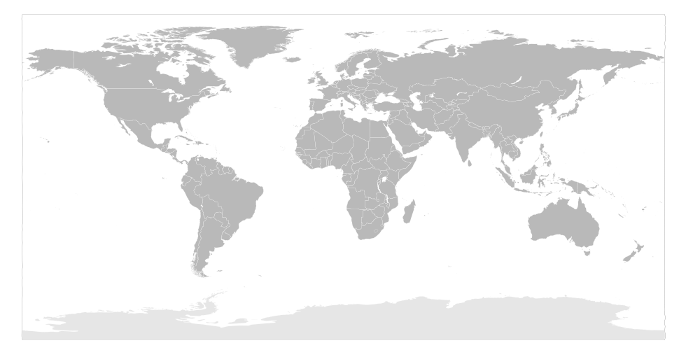
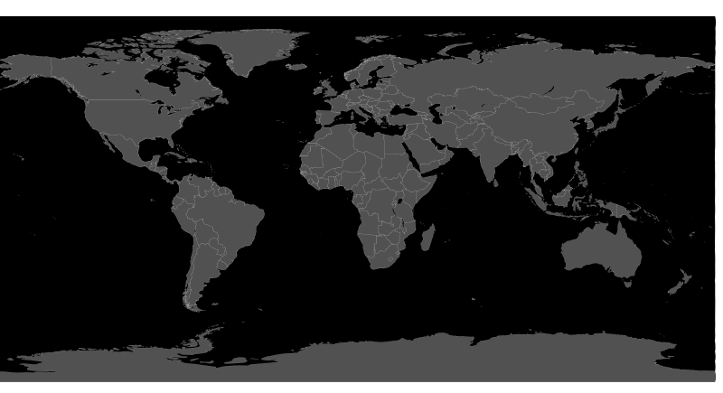
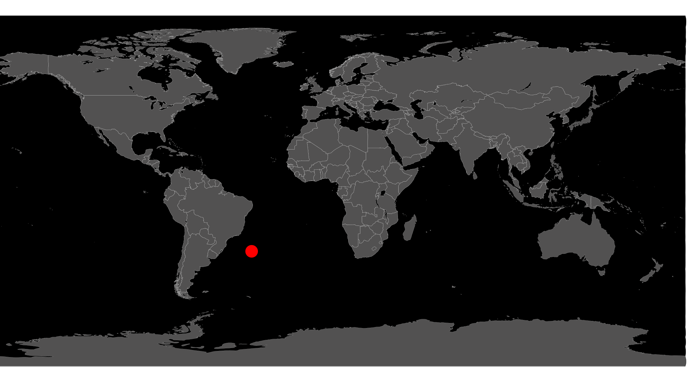
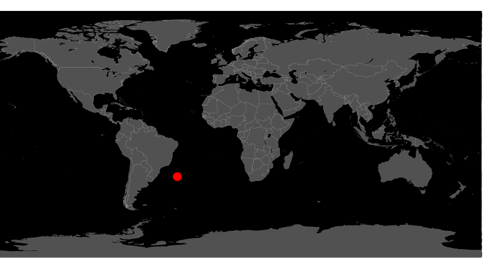

# Designing Interactive SVGs with AI

A short course for designers on making interactive SVGs with AI help. It will be presented as a [CreativeMornings FieldTrip](https://creativemornings.com/fieldtrips) in January 2026. [View Presentation](https://steveturbek.github.io/Designing-Interactive-SVGs-with-AI/presentation.svg)

<figcaption>
<b> for the best experience, go to the <a href="https://steveturbek.github.io/Designing-Interactive-SVGs-with-AI/">actual article web page</a></b></figcaption>

## TLDR

- Designers know design tools, but coding and interaction is often a challenge
- The SVG file format, known for icons, is unexpectedly, a powerful format similar to HTML. One can have style sheets and javascript in the file.
- Designers can use SVGs to include interactivity and delight in a project without breaking dev resources or code rules.
- SVG is a vector format, but is written in a language like HTML
- LLMs are great at manipulating language
- With proper set up, a designer can upload an image and collaborate the interaction into life.
- The SVG is now portable, contains its code.
- One can 'round trip' between design programs and AI, made easier with the tools iincluded here


## Background

I teach the "[Tangible Interfaces](https://steveturbek.github.io/Tangible-Interfaces/)" Senior Design Studio in the Industrial Design program at Pratt Institute.

In my workshop, the students designed a dashboard instrument (like on a car dashboard). (We are designing personal submarines)
I wrote a “Skill” to prep the AI to focus on the right thing, and use the right context. They had no coding experience, It was pretty magical….

The workshop is not specifically about dashboard elements. It is more conceptual reframing about design tools and AI, and rediscovering tools we designers always had.

## What is SVG and can it be cured?

As we all know, markup languages were given to humans by ancient aliens. We have be able to reconstruct it as "SGML" or Standard Generalized Markup Language. No one speaks SGML today, but archeological evidence suggests SGML was used in "newspapers" and "magazines", which appeared to made by primitive people from trees or bark.

The basic idea is to wrap data in tags so both computers and people could understand it. `<person><name>Alice</name><age>30</age></person>`

SGML had many descendants, including Hyper Text Markup Language, XML, and hundreds of niche markup formats. The main one that survives today is SVG or Scalable Vector Graphics.

SVGs are an **graphic** format, like JPEG, GIF, PNG. But they store the information not as pixels, but math. It has lines, rectangles, circles, and any complex curved shape. (If you think of the drawing tools in Adobe Illustrator or Figma, these are **vector** shapes.). This means that the file size is tiny, but they are **scalable** up to a billboard size without becoming blurry. Fonts are a kind of vector file as well. They are used everywhere, especially on the web.

## What was Flash and why did it matter?

Flash was a program that made animations that ran in the web browsers of the 90's and early 2000's. By working consistently across browsers (a huge problem of the time), it enabled designers to deliver a beautiful experience. It was the only way to deliver video and music streams, and became wildly popular, to the point that entire websites would simply be a flash file.

Flash was a designer's program. Flash empowered designers to lay out scenes and animations with drawing tools and interactivity, without requiring programming knowledge. When Flash was killed, complex JavaScript-driven websites took over, which effectively meant the web became the domain of programmers rather than visual designers.

I was never a Flash designer/developer. Like many 90's kid designers, I learned programming in a program called Macromedia Director, most famous for making interactive CD-ROMs, which, I swear, were a big deal. I used to it to make interactive games and experiences, sadly, not visible on today's technology.

**_We should morn the loss of a tool that empowered designers to think in their own visual language and create the item rather than write specification documents to instruct others what to do._**

## "OK, Old timer, why does SVG matter to-day"?

SVG is widely used on the web for icons and illustrations. BUT its origin story gives it secret powers from ancient times.

**_Inside the SVG file_**

- CSS can style SVG elements: Animations
- JavaScript can manipulate the file: Interactivity
- JavaScript can load data: Data Visualization

SVGs matter because:

1. You, a designer, can use your tools like (Figma, Adobe Illustrator, or the open source Inkscape) and save as SVG.
1. You, a designer, can upload the SVG to your website, even locked down corporate Content Managed sites, where you can't get any dev resources to make your cool interactions.
1. SVGs can carry their styling and interaction code inside the file, which is encapsulated, so it can't break the website it is on.
1. They can use javascript to call out to the web and get data, like in a dashboard.
1. SVGs are written as a language and AIs are excellent at interpreting language.
1. As you, a designer, always name your design file layers (right??), you and the AI can have a specific conversation. "Rotate item carLogo 30 degrees" is very legible to an AI.

_One of the reasons AI is bad at understanding your prompts, is your human language prompts are simply not detailed enough. The big enhancement of modern AIs is they just guess what you might have meant. For most people this is fine, but designers care about the details.
_

### Animation

I'm not going to go deep into animation as there are so many more competent people (see references). But I want to highlight one because it is so conceptually cool. I'm sure you have seen the animation of someone drawing an item, like this.  


What if I told you that this animation was only a couple of lines of code - the conceptual idea was to make this shape have a dashed line, only with really huge dashes, and slide that dash along the line. The designer never drew anything.

### Interactivity

Basically, everything you can do with a webpage: rollovers, buttons, etc can be done in a SVG. It uses the browser Javascript, almost the same as the web page.

### Interactive Color Wheel

Interactive SVGs can be a game changer for designers working with Devs.

A designer can ‘sneak’ interactivity into old codebases where they couldn’t touch the code, by uploading an image to a Content Management System.

I made this handy color wheel for our Goldman Sachs Design System (which was public when I lead the team). It is still [available on Archive.org](https://web.archive.org/web/20220819072910/https://design.gs.com/home)

_Hover over any color segment to view its name, RGB values, and hex code. Click to lock the color information to copy values._

<object data="images/GSDS-color-wheel-v2.svg" type="image/svg+xml" width="700" height="800">
  
</object>

## The workshop: Coding an interactive, data driven, illustration

We are not going to recreate Flash in this workshop. If you want to get deep into data visualization, you should learn the real tools like [D3js](https://d3js.org/what-is-d3)
The [gallery](https://observablehq.com/@d3/gallery) is awesome!
What we will do:

- Design an image of a data visualization
- Save as SVG
- Add some code using my helpers
- Work with AI to get it right

You need:

- A design software Adobe Illustrator is the best for this demo.
- Chrome browser and the internet
- AI access. They all can work, ChatGPT allows SVG upload without paying.
- 60 minutes

### Workshop 1: Chart the International Space Station's location on a map

1. Let's start with a [Equirectangular World Map](https://commons.wikimedia.org/wiki/File:BlankMap-World-Equirectangular.svg) _Thanks Wikipedia and John Harvey_



1. Let's make is dark by editing the CSS in the file



1. Let's add a red circle in the middle, to represent the ISS
   Do it in your design program OR try simply pasting `<circle id="ISS" style="fill:red;fill-opacity:1" cx="1000" cy="1000" r="25"/>` right before the closing `</svg>`. (It makes a circle.)



1. Let's use the first of my helpers, the [SVG Code Setup](helpers/svg-code-setup.html). It adds a blank javascript template to the SVG so you can tell the AI where to put the code. It doesn't look different, but open the file in textEdit to look at the text.



1. Go to an <a href="ChatGPT.com" target="new">AI</a> an paste in this starter prompt

```
I want to add interactivity to a SVG file using javascript.
I'm a design student and don't understand programming, so you will need to be my guide and do it for me.

This project uses an open source guide found at https://github.com/steveturbek/Designing-Interactive-SVGs-with-AI

I am next going to paste 2 texts
- svg-AI-helper-SKILL.md is a AI Skill instructions to guide you.
- a SVG file which has the code we want to adjust

Here is what I want to happen:

There is
In the SVG file is a group with the ID 'ISS", which contains a red circle


As output, I want you to create a svg file so I can download it and put it in the game as a 'drop in' replacement for elevator.svg


Don't make the file until I have pasted all files! Does this make sense?  Ask any questions you need to.
```

### Workshop 4: Submarine Instruments and working with apps

Here is an [example chat session](https://chatgpt.com/share/690a222c-f46c-800d-9600-128b0e82be92) to show the back and forth redesigning a dashboard instrument.

## Tips and Notes

### Security Note

Like all code, javascript can be used to harm people. Some websites have strict rules against SVG or disable javascript in SVG to prevent people from stealing other people's data. Don't be evil.


### SVG History (I swear this matters)

[Wikipedia on SVG](https://en.wikipedia.org/wiki/SVG)

**Early development (late 1990s)**

- Multiple competing proposals submitted to W3C for vector graphics on the web
- Microsoft had VML (Vector Markup Language)
- Adobe, Sun, others had PGML (Precision Graphics Markup Language)
- Macromedia had proposals too
- W3C merged ideas into SVG specification

**SVG 1.0 (2001)**

- First official W3C recommendation
- XML-based vector graphics format
- Designed to work with other web standards (CSS, JavaScript, DOM)

**The plugin era (2001-2010)**

- Browsers had poor native support
- Adobe SVG Viewer plugin was common
- Competed with Flash, which dominated vector/animation on web
- SVG existed but wasn't widely used for actual websites

**Mobile/Flash's decline (2007-2010)**

- iPhone didn't support Flash
- Steve Jobs's famous letter against Flash (2010)
- Suddenly need for open, standard vector format
- Browsers started implementing native SVG support seriously
- Mobile phones supported it before most desktop browsers.

**Modern era (2010s+)**

- All major browsers support SVG natively
- Became standard for responsive icons, logos, data visualizations
- Tools like D3.js made SVG the de facto standard for web-based charts
- Design tools (Sketch, Figma, Illustrator) all export SVG

**_The irony: took 10+ years to become useful because browser support lagged, then Flash's death suddenly made it essential._**

## Why does the history of SVG matter?

_Side note: its fascinating to see the present from the perspective of the past. Things that are fact today, was just someone's, like, opinion._

People thought that slow phone speeds meant we should have a completely web for phone written in "[WML(https://en.wikipedia.org/wiki/Wireless_Markup_Language)]".

## Death of Flash

Flash had a visual style that defined 1990s websites, for better and worse. Like any tool that empowers many people, it became associated with cheaply written web games and cartoons. When Steve Jobs killed Flash for being a ["closed system"](https://en.wikipedia.org/wiki/Thoughts_on_Flash) LOL, and not for competing with the App store.

The web also changed from wacky personal experiences to a more professional, some would say banal, standard.

### Fonts

One can use Web Fonts. Google fonts and [Adobe fonts](https://fonts.adobe.com/my_fonts#web_projects-section).

## References

- [The Secret Origin of SVG](https://www.w3.org/Graphics/SVG/WG/wiki/Secret_Origin_of_SVG)
- [History of Scalable Vector Graphics (SVG) File Format Family](https://www.loc.gov/preservation/digital/formats/fdd/fdd000515.shtml)
- [W3C SVG 1.1 Specification - Scripting](https://www.w3.org/TR/SVG11/script.html)

### Online Guides for Learning CSS Animations for SVGs

#### For Beginners

- [CSS-Tricks](https://css-tricks.com/animating-svg-css/)
- [LogRocket](https://blog.logrocket.com/how-to-animate-svg-css-tutorial-examples/)
- [Toptal](https://www.toptal.com/css/svg-animation-css-tutorial)

#### Comprehensive Learning

- [Interactive SVG Animations](https://www.svg-animations.how/)
- [Smashing Magazine](https://www.smashingmagazine.com/2014/11/styling-and-animating-svgs-with-css/)

#### Reference Documentation

- [W3Schools](https://www.w3schools.com/graphics/svg_animation.asp)
- [MDN](https://developer.mozilla.org/en-US/docs/Web/SVG/Reference/Element/animate)

### Software Tools for SVG Animation

#### No-Code Animation Tools

- [SVGator](https://www.svgator.com/)
- [SVG AI](https://www.svgai.org/animate)

#### Design Software with SVG Support

- Adobe Illustrator
- Inkscape
- Figma
- Affinity Designer (I haven't used)

### APIs to consider

- [where is the International Space Station](http://api.open-notify.org/iss-now.json)
- [weather on Mt Everest](https://api.open-meteo.com/v1/forecast?latitude=27.9882&longitude=86.9254&current_weather=true)
- [USD to GBP Exchange Rate](https://api.coinbase.com/v2/prices/GBP-USD/spot)
- [USD to EUR Exchange Rate](https://api.coinbase.com/v2/prices/EUR-USD/spot)

<!-- https://commons.wikimedia.org/wiki/File:International_Space_Station_top_view.svg -->
